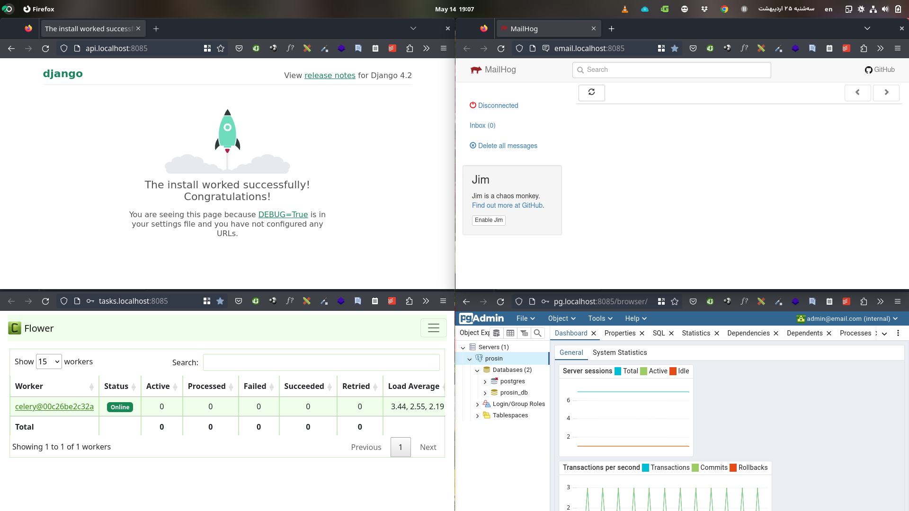
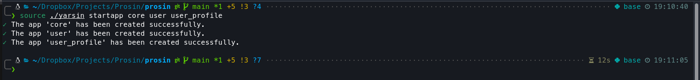
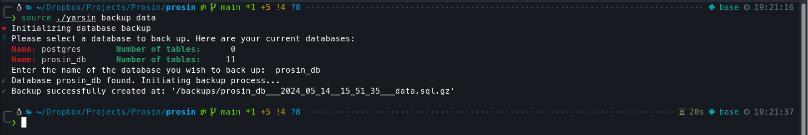

<div dir="rtl" style="text-align: right; font-family: 'IRANXSans', 'Vazirmatn', 'Arial, sans-serif;" contenteditable="true">

# پروسین

**پُروسین** [یه](https://fa.wiktionary.org/wiki/یه) [رابَک](https://fa.wiktionary.org/wiki/رابک) رِسْت (REST API) با جنگو است که برای [آغازیدن](https://fa.wiktionary.org/wiki/آغازیدن) (آغاز کردن) سریعتر و آسانتر [یه](https://fa.wiktionary.org/wiki/یه) پروژه جدید [داکریسِشْته شده](https://fa.wiktionary.org/wiki/داکریسشته) (داکرسازی شده).

## [تَهُبین](https://fa.wiktionary.org/wiki/تهبین) (تهش را ببین)

در آخر، پروژه‌ات بشکلی [پِیْکرِشته](https://fa.wiktionary.org/wiki/پیکرشته) (پیکربندی شده) که سرویس‌های زیر را داری:

- سرویس MailHog برای آزمودن خدمت‌های ایمیلی
- سرویس Flower برای دیدن وضعیت وظیفه‌های ناهمزمان
- سرویس pgAdmin برای [دَبِّریدن](https://fa.wiktionary.org/wiki/دبریدن) (مدیریت) پایگاه‌داده



و [یه](https://fa.wiktionary.org/wiki/یه) دستیار هم به نام `yarsin` تا باهاش به‌آسانی دستورهای مربوط به هر کانتینر داکر را داخل کانتیر مناسب اجرا کنی، مثلا برای ساختن [ریزبرکاهای](https://fa.wiktionary.org/wiki/ریزبرکا) (app) `core`، `user`، و `user_profile` کافیه دستور زیر را اجرا کنی:

<div dir="ltr" lang="en" style="text-align: left;" contenteditable="true">

```bash
source ./yarsin startapp core user user_profile
```

</div>



و برای [مانوزدن](https://fa.wiktionary.org/wiki/مانوزدن) (بکاپ گرفتن از) پایگاه‌داده‌ات:

<div dir="ltr" lang="en" style="text-align: left;" contenteditable="true">

```bash
source ./yarsin startapp backup data
```

</div>



## [بَهْرِش](https://fa.wiktionary.org/wiki/بهرش) (روش استفاده)

**توجه.** برای [بهریدن](https://fa.wiktionary.org/wiki/بهریدن) (استفاده کردن از) این منبع باید [داکر](https://docs.docker.com/desktop/) و [داکرکامپوز](https://docs.docker.com/compose/install/) در سیستم‌ات [نَصْبِشته](https://fa.wiktionary.org/wiki/نصبشتن) (نصب شده) باشند. و بهتره [Makefile](https://makefiletutorial.com/) هم [نَصْبِشته باشد](https://fa.wiktionary.org/wiki/نصبشتن) وگرنه باید دستورهای در `Makefile` را بشکل دستی [بِاِجراری](https://fa.wiktionary.org/wiki/اجراردن) (اجرا کنی).

**توجه.** بسته به نیازت می‌توانی نیازمندی‌های هر [اجرالان](https://fa.wiktionary.org/wiki/اجرالان) (محیط اجرایی) را، که در فایل‌های `requirements/*.txt` [عَلَنِشْته شده‌اند](https://fa.wiktionary.org/wiki/علنشتن) (اعلان شده‌اند)، [بِصُلحی](https://fa.wiktionary.org/wiki/صلحیدن) (اصلاح کنی).

### [آغازیدن](https://fa.wiktionary.org/wiki/آغازیدن)

ابتدا، برای [آغازیدن](https://fa.wiktionary.org/wiki/آغازیدن) (آغاز کردن) [یه](https://fa.wiktionary.org/wiki/یه) پروژه جدید جنگو، گام‌های زیر را [بِپِیْمو](https://fa.wiktionary.org/wiki/پیمودن) (دنبال کن):

- نخست برای [اَلانیدن](https://fa.wiktionary.org/wiki/الانیدن) (بروز کردن) نسخه بسته‌ها در فایل‌های <span dir="ltr">`./requirements/*.txt`</span>، فرمان زیر را در [یه](https://fa.wiktionary.org/wiki/یه) [کارهال](https://fa.wiktionary.org/wiki/کارهال) (پایانه؛ ترمینال) [بِاِجْر](https://fa.wiktionary.org/wiki/اجریدن) (اجرا کن):

  <div style="direction: ltr; text-align: left;" contenteditable="true">

  ```bash
  make update-requires
  ```

  </div>

- سپس، برای [آغازیدن](https://fa.wiktionary.org/wiki/آغازیدن) پروژه جدید به نام `config` دستور زیر را [بِاِجْرْ](https://fa.wiktionary.org/wiki/اجریدن) (اجرا کن):

  <div style="direction: ltr; text-align: left;" contenteditable="true">

  ```bash
  make init
  ```

  </div>

### [پِیْکَریدن](https://fa.wiktionary.org/wiki/پیکریدن) (پیکربندی) پایه

سپس، برای [اِجْریدَن](https://fa.wiktionary.org/wiki/اجریدن) (اجرا کردن) پروژه در [اِجرالان](https://fa.wiktionary.org/wiki/اجرالان) [وُسْعُش](https://fa.wiktionary.org/wiki/وسعش) (محیط توسعه) یا [بَهْرِش](https://fa.wiktionary.org/wiki/بهرش) (بهره‌بری) گام‌های زیر را [بِپِیْمو](https://fa.wiktionary.org/wiki/پیمودن) (دنبال کن):

1. [جاگُزیدن](https://fa.wiktionary.org/wiki/جاگزیدن) (جایگزین کردن) [غِیْرپِذیرهای](https://fa.wiktionary.org/wiki/غیرپذیر) [اِجرالانی](https://fa.wiktionary.org/wiki/اجرالان) (متغیرهای محلی) با اطلاع‌های حساس در <span dir="ltr">`./config/settings/base.py`</span>، برای افزایش امنیت و [عَطْفْپِذیری](https://fa.wiktionary.org/wiki/عطفپذیری) (انعطافپذیری):

   <div dir="ltr" lang="en" style="text-align: left;" contenteditable="true">

   ```python
   # ./config/settings/base.py
   # ...
   from environ import Env

   env = Env()
   # ...
   SECRET_KEY = env.str("SECRET_KEY")
   # ...
   DEBUG = env.bool("DJANGO_DEBUG", False)
   # ...
   DATABASES = {"default": env.db("DATABASE_URL")}
   # ...
   # ADMIN_URL is used to specify the subdomain path for accessing the Django admin interface.
   ADMIN_URL = "dashsin/"
   ```

   </div>

2. [تایِسْتَن](https://fa.wiktionary.org/wiki/تایستن) (سازماندهی کردن) [بِرْکاها](https://fa.wiktionary.org/wiki/برکا) (apps)، برای در [یه](https://fa.wiktionary.org/wiki/یه) پوشه بودن:

   <div dir="ltr" lang="en" style="text-align: left;" contenteditable="true">

   ```python
   # ./config/settings/base.py
   # ...
   # Build paths inside the project like this: ROOT_DIR / 'subdir'.
   BASE_DIR = Path(__file__).resolve().parent.parent.parent
   ASSETS_DIR = "/assets"

   # ...

   # Application definition

   DJANGO_APPS = [  # Django Core Apps
       # The Django admin app provides a customizable admin interface for managing the site's data.
       "django.contrib.admin",
       # The Django auth app provides authentication and authorization functionalities for users.
       "django.contrib.auth",
       # The contenttypes app provides content type and generic foreign key support for models.
       "django.contrib.contenttypes",
       # The sessions app manages user sessions and session data.
       "django.contrib.sessions",
       # The messages app handles temporary messages for users, such as success or error messages.
       "django.contrib.messages",
       # The staticfiles app helps manage static files like CSS, JavaScript, and images.
       "django.contrib.staticfiles",
       # The sites app allows the site to be associated with multiple domains.
       "django.contrib.sites",
   ]

   THIRD_PARTY_APPS = [  # Third-Party Apps
       # Django REST framework is a powerful toolkit for building Web APIs in Django
       "rest_framework",
       # Allows filtering of querysets in Django based on specified parameters
       "django_filters",
       # Provides a country field for Django models, allowing easy selection and storage of countries
       "django_countries",
       # Simplifies handling and validation of phone number fields in Django models
       "phonenumber_field",
   ]

   PROJECT_APPS = [  # Custom Apps
       # "apps.core",
   ]

   # Combine all installed apps
   INSTALLED_APPS = DJANGO_APPS + THIRD_PARTY_APPS + PROJECT_APPS
   # ..
   ```

   </div>

3. [مِلَلیبدَن](https://fa.wiktionary.org/wiki/مللیبدن) (بین‌المللی کردن)، برای محلی و چند زبانه شدن:

   <div dir="ltr" lang="en" style="text-align: left;" contenteditable="true">

   ```python
   # ./config/settings/base.py
   # ...
   from django.utils.translation import gettext_lazy as _
   # ...
   # Internationalization
   # https://docs.djangoproject.com/en/4.2/topics/i18n/

   TIME_ZONE = "Asia/Tehran"
   USE_TZ = True

   LANGUAGE_CODE = "en-us"
   LANGUAGES = [
       ("en", _("English")),
       ("fa", _("Persian")),
   ]

   LOCALE_PATHS = [BASE_DIR / "locale"]

   USE_I18N = True

   USE_L10N = True  # Enable localization
   # ...
   ```

   </div>

4. [پِیْکَریدن](https://fa.wiktionary.org/wiki/پیکریدن) فایل‌های [ایستا](https://fa.wiktionary.org/wiki/ایستا) (static) و رسانه (media):

   <div dir="ltr" lang="en" style="text-align: left;" contenteditable="true">

   ```python
   # ./config/settings/base.py
   # ...
   # Static files (CSS, JavaScript, Images)
   # https://docs.djangoproject.com/en/4.2/howto/static-files/

   # Static files settings
   STATIC_URL = "static/"
   STATIC_ROOT = ASSETS_DIR + "/static"

   # Media files settings
   MEDIA_URL = "media/"
   MEDIA_ROOT = ASSETS_DIR + "/media"
   # ...
   ```

   </div>

5. [نَصبیدن](https://fa.wiktionary.org/wiki/نصبیدن) (نصب کردن) `celery`، برای [عُرْفیدن](https://fa.wiktionary.org/wiki/عرفیدن) (تعریف کردن) و [اِجْرادن](https://fa.wiktionary.org/wiki/اجرادن) (اجرا کردن) وظیفه‌های ناهمزمان (Asynchronous):

   1. [ایجیدن](https://fa.wiktionary.org/wiki/ایجیدن) (ایجاد کردن) فایل [پِیْکَرِش](https://fa.wiktionary.org/wiki/پیکرش) <span dir="ltr">`./config/celery.py`</span> همانند زیر:

      <div dir="ltr" lang="en" style="text-align: left;" contenteditable="true">

      ```python
      # ./config/celery.py
      """
      Celery app configuration for Django project.
      """

      import os

      from celery import Celery
      from django.conf import settings

      # TODO: Change the default value of DJANGO_SETTINGS_MODULE for the production   environment  # pylint: disable=W0511
      os.environ.setdefault("DJANGO_SETTINGS_MODULE", "config.settings.development")

      # Initialize a new Celery app instance with the name "config"
      app = Celery("config")

      # Configure the Celery app using the settings in the "CELERY" namespace
      app.config_from_object("django.conf:settings", namespace="CELERY")

      # Automatically discover and register any tasks defined in installed apps
      app.autodiscover_tasks(lambda: settings.INSTALLED_APPS)

      def get_celery_app():
          """
          Returns the Celery app instance.

          Returns:
              Celery: The Celery app instance.
          """

          return app

      ```

      </div>

   2. و [پِیکِریدن](https://fa.wiktionary.org/wiki/پیکریدن) `celery` همانند زیر در فایل <span dir="ltr">`./config/settings/base.py`</span>:

      <div dir="ltr" lang="en" style="text-align: left;" contenteditable="true">

      ```python
      # ./config/settings/base.py
      # ...
      from config.celery import get_celery_app
      # ...

      # Specifies the primary key of the Site object for the current site in the Django project.
      SITE_ID = 1


      # Celery configuration settings

      celery = get_celery_app()

      # Specifies the URL of the Celery broker for handling task messages
      CELERY_BROKER_URL = env.url("CELERY_BROKER_URL")
      # Specifies the URL of the backend for storing Celery task results
      CELERY_RESULT_BACKEND = env.url("CELERY_RESULT_BACKEND")
      # Defines the content types accepted by Celery tasks
      CELERY_ACCEPT_CONTENT = ["json"]
      # Specifies the serializer used for serializing Celery task messages
      CELERY_TASK_SERIALIZER = "json"
      # Specifies the serializer used for serializing Celery task results
      CELERY_RESULT_SERIALIZER = "json"
      # Enables sending task-sent events for Celery results
      CELERY_RESULT_SEND_SENT_EVENT = True

      # Sets the timezone for Celery tasks based on the project's timezone setting
      if USE_TZ:
          CELERY_TIMEZONE = TIME_ZONE
      # ...
      ```

      </div>

### [پِیْکَریدن](https://fa.wiktionary.org/wiki/پیکریدن) [اِجْرالان](https://fa.wiktionary.org/wiki/اجرالان) [وُسْعِش](https://fa.wiktionary.org/wiki/وسعش) (پیکربندی کردن محیط توسعه)

و پس از آن، برای [پِیْکِریدن](https://fa.wiktionary.org/wiki/پیکریدن) (پیکربندی) [اِجرالان](https://fa.wiktionary.org/wiki/اجرالان) [وُسْعِش](https://fa.wiktionary.org/wiki/وسعش) (محیط توسعه) این گام‌ها را [بِپِیْمو](https://fa.wiktionary.org/wiki/پیمودن) (دنبال کن):

1. [عُرفیدن](https://fa.wiktionary.org/wiki/عرفیدن) [پِیْکَرال](https://fa.wiktionary.org/wiki/پیکرال) (فایل پیکربندی) <span dir="ltr">`./config/settings/development.py`</span> همانند زیر:

   <div dir="ltr" lang="en" style="text-align: left;" contenteditable="true">

   ```python
   """
   Django settings for development environment.

   Settings in this file are used for development only.
   """

   from .base import *  # pylint: disable=unused-wildcard-import, wildcard-import # noqa

   # List of host/domain names that this Django site can serve. Must be set in production to prevent host header attacks.
   ALLOWED_HOSTS = []

   ```

   </div>

### [اِجْرارْدَن](https://fa.wiktionary.org/wiki/اجریدن) (اجرا کردن) پروژه

در آخر، برای [اِجٌرارْدَن](https://fa.wiktionary.org/wiki/اجراردن) (به اجرا درآوردن) پروژه‌ات دستور زیر را [بِاِجْرْ](https://fa.wiktionary.org/wiki/اجریدن) (اجرا کن):

<div dir="ltr" style="text-align: left;" contenteditable="true">

```bash
make up
```

</div>

تمام! حالا ازطریق [وَنْدال‌های](https://fa.wiktionary.org/wiki/وندال) (لینک‌های) زیر می‌توانی به هر یک از سرویس‌هایت [بِدَسْرِسْئی](https://fa.wiktionary.org/wiki/دسرسئیدن) (دسترسی داشته باشی):

- [دَبِّرال](https://fa.wiktionary.org/wiki/دبرال) جنگو (مدیریت جنگو): <span dir="ltr">[dashsin.localhost:8085/admin/](http://dashsin.localhost:8085/admin/)</span>
- [دَبِّرال](https://fa.wiktionary.org/wiki/دبرال) ایمل‌ها (MailHog): <span dir="ltr">[email.localhost:8085/](http://email.localhost:8085/)</span>
- [نَمایال](https://fa.wiktionary.org/wiki/نمایال) وظیفه‌ها (Flower): <span dir="ltr">[tasks.localhost:8085/](http://tasks.localhost:8085/)</span> (user: `admin`, pass: `123456`)
- [دَبِّرال](https://fa.wiktionary.org/wiki/دبرال) پایگاه‌داده (pgAdmin): <span dir="ltr">[pg.localhost:8085/](http://pg.localhost:8085/)</span> (user: `admin@email.com`, pass: `123456`)

## یارْسین

برای اینکه [وُسْعَنده‌ها](https://fa.wiktionary.org/wiki/وسعنده) (توسعه دهنده‌ها) خیلی درگیر کار با کانتینرهای داکر نشوند، می‌توان بشکل زیر از <span dir="ltr">`./yarsin`</span> برای [اِجریدن](https://fa.wiktionary.org/wiki/اجریدن) (اجرا کردن) دستورهای `django-admin` و دیگر دستورها [بَهْرْئید](https://fa.wiktionary.org/wiki/بهرئیدن) (سود برد):

<div dir="ltr" lang="en" style="text-align: left;" contenteditable="true">

```bash
source ./yarsin [django-admin comments|cuatom camments] [options]
```

</div>

مثلا، برای [آغازیدن](https://fa.wiktionary.org/wiki/آغازیدن) (آغاز کردن) چند [بِرْکا](https://fa.wiktionary.org/wiki/برکا) (برنامه کاربردی) کافیه همانند زیر [بِعَمَلی](https://fa.wiktionary.org/wiki/عملیدن) (عمل کنی):

<div dir="ltr" lang="en" style="text-align: left;" contenteditable="true">

```bash
source ./yarsin startapp core user
```

</div>

**بِوَجْه:** این درمودر همه دستورهای معتبر `django-admin` برقرار است!

### دستورهای مهم `yarsin`

- [مانوزْدَن](https://fa.wiktionary.org/wiki/مانوزدن) پایگاه‌داده (پشتیبان‌گیری در سطح پایگاه‌داده):

  <div dir="ltr" lang="en" style="text-align: left;" contenteditable="true">

  ```bash
  source ./yarsin backup data
  ```

  </div>

- [مانوزْدَن](https://fa.wiktionary.org/wiki/مانوزدن) [سَمْپاد](https://fa.wiktionary.org/wiki/سمپاد) (پشتیبان‌گیری در سطح فایل):

  <div dir="ltr" lang="en" style="text-align: left;" contenteditable="true">

  ```bash
  source ./yarsin backup dbms
  ```

  </div>

- [پیشارْدَن](https://fa.wiktionary.org/wiki/پیشاردن) (برگرداندن) پایگاه‌داده:

  <div dir="ltr" lang="en" style="text-align: left;" contenteditable="true">

  ```bash
  source ./yarsin restore data
  ```

  </div>

- [پیشارْدَن](https://fa.wiktionary.org/wiki/پیشاردن) (برگرداندن) [سمپاد](https://fa.wiktionary.org/wiki/سمپاد):

  <div dir="ltr" lang="en" style="text-align: left;" contenteditable="true">

  ```bash
  source ./yarsin restore dbms
  ```

  </div>

</div>
